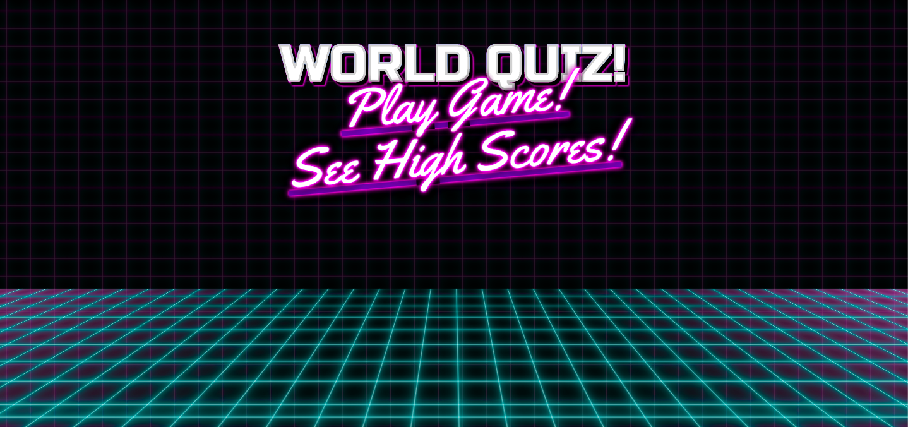
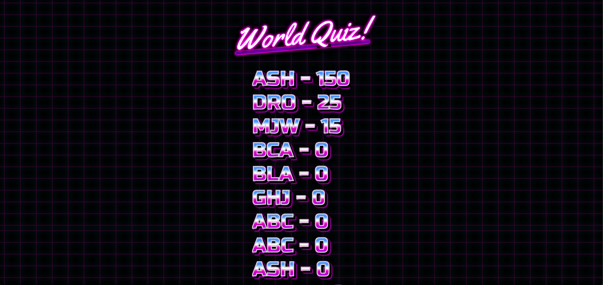
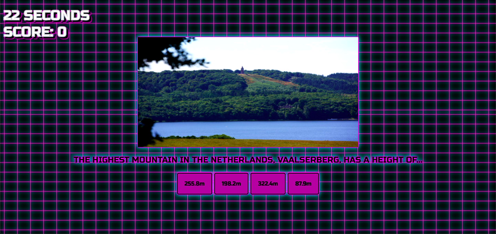

Group project build with React/Redux.

Our Aim was to develop a game logic that users can answer questions regarding curiosityes from places all around the world.
For styaling we used an 80's arcade theme with sound effects.
We also hid an easter egg button where users can add more questions.
Can you find it?

Feel free to clone this public repository and if you have any questions, contact any of its creators.

Ariel Shadmon - github.com/finerio  
Maria Julia Soler - github.com/MajuSoler  
Patrick Oves Weiss - github.com/powsitu  

We also have a backend for this project that can be acessed here:  
https://github.com/MajuSoler/travel-game_backend

Deplyoment:  
https://travelgame.netlify.app/

